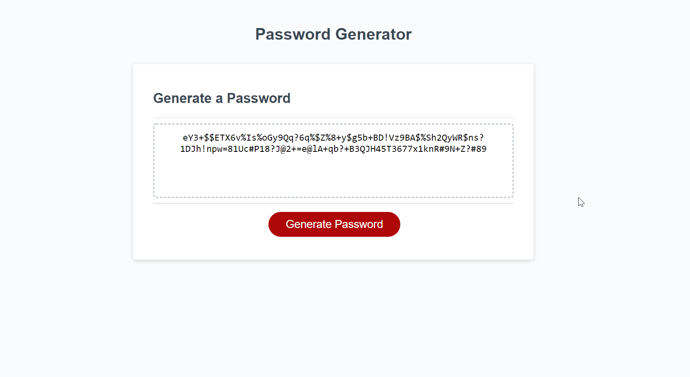

# 03-JavaScript-Password-Generator

## Deployed Site:

https://darnocer.github.io/03-JavaScript-Password-Generator/

## Description

While not the most secure password generator, this was an assignement that challenged us to generate a password based on user input (Acceptance Criteria below).

After clicking the "Generate Password" button, you are asked a series of the following prompts:

- How many characters would you like the password length to be?
- Would you like it to contain lowercase letters?
- Would you like it to contain uppercase letters?
- Would you like it to contain numbers?
- Would you like it to contain special characters?

A password meeting the specified criteria is then returned.


## Test Cases

This password generator passes the following test cases:

- Password length entered is < 8, > 128, or NaN -> Prompt to enter valid input
- Cancel at password length prompt -> end program
- At least one of each of the selected character types (lowercase, uppercase, numbers, special characters) is contained within the password
- No character types selected -> prompts to select at least one charcter type and returns to the first character type prompt
- Generating a password again in the same session -> replaces old password with new password

## Acceptance Criteria

```
GIVEN I need a new, secure password
WHEN I click the button to generate a password
THEN I am presented with a series of prompts for password criteria
WHEN prompted for password criteria
THEN I select which criteria to include in the password
WHEN prompted for the length of the password
THEN I choose a length of at least 8 characters and no more than 128 characters
WHEN prompted for character types to include in the password
THEN I choose lowercase, uppercase, numeric, and/or special characters
WHEN I answer each prompt
THEN my input should be validated and at least one character type should be selected
WHEN all prompts are answered
THEN a password is generated that matches the selected criteria
WHEN the password is generated
THEN the password is either displayed in an alert or written to the page
```
