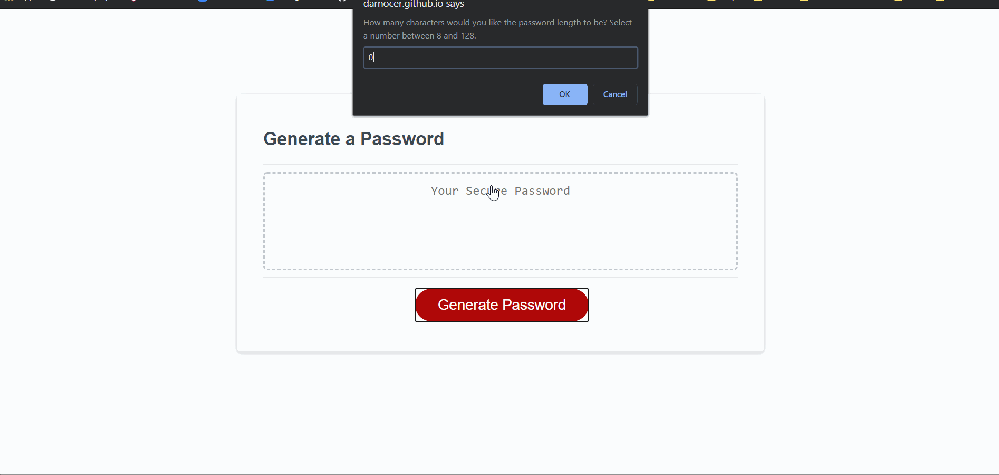

# Password Generator

 

### URL: https://darnocer.github.io/JavaScript-Password-Generator/

## Description

This is a simple javascript application to generate a password based on user-inputted criteria.

## Table of Contents

- [Installation](#installation)
- [Usage](#usage)
- [Credits](#Credits)
- [Tests](#tests)
- [Questions](#questions)

## Usage

After clicking the "Generate Password" button, you are asked a series of the following prompts:

- How many characters would you like the password length to be?
- Would you like it to contain lowercase letters?
- Would you like it to contain uppercase letters?
- Would you like it to contain numbers?
- Would you like it to contain special characters?

* _Note: not the most secure password generator :)_

## Tests

This password generator passes the following test cases:

- Password length entered is < 8, > 128, or NaN -> Prompt to enter valid input
- Cancel at password length prompt -> end program
- At least one of each of the selected character types (lowercase, uppercase, numbers, special characters) is contained within the password
- No character types selected -> prompts to select at least one charcter type and returns to the first character type prompt
- Generating a password again in the same session -> replaces old password with new password

## Questions?

Contact me at [darian.nocera26@gmail.com](mailto:darian.nocera26@gmail.com)

or 

Copyright © 2020 [Darian Nocera](http://www.github.com/darnocer)

---

##### _Created with [darnocer's README generator](https://github.com/darnocer/Node.js-and-ES6-README-Generator)_ 👽
